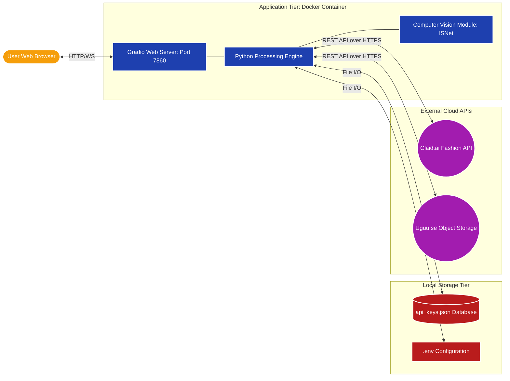

# AkshayKala AI Studio
**Generative AI Engine for Fashion Mockup Synthesis**

[](https://opensource.org/licenses/MIT)
[](https://www.python.org/downloads/release/python-3120/)
[](https://www.docker.com/)

A production-grade, containerized web application that automates the generation of professional jewelry mockups. The system replaces expensive fashion model photoshoots with an end-to-end automated pipeline powered by advanced Computer Vision and Generative AI.

---

## Introduction

Jewelry is one of the highest-consideration purchases in e-commerce. A customer cannot feel the weight or hold it up to their ear. The product image is the product. For a brand releasing hundreds of SKUs per season, every single one needs a clean product shot, a lifestyle shot, and an on-model shot.

The industry standard for producing those images is a traditional studio photoshoot with models, lighting rigs, photographers, and post-production editors. For a brand like AkshayKala, this means thousands of rupees per session and days of turnaround time. At 50 SKUs it is manageable; at 500, it is a crisis. Cost scales linearly, speed does not improve, and visual consistency is impossible to guarantee.

**The AkshayKala AI Studio** solves this by transforming a logistical bottleneck into a scalable, zero-cost software pipeline. It eliminates the need for physical studios and paid fashion models.

---

## Project Structure

This repository contains the final production system (`app.py`) along with standalone reference modules (`core/`) that break down the technical logic for educational and portfolio review purposes.

```text
AkshayKala-AI-Studio/
├── app.py                      # Main Gradio application & unified pipeline
├── Dockerfile                  # Container definition
├── scripts/                    # Cross-platform Docker launchers
├── core/                       # Standalone reference implementations
│   ├── segmentation.py             # ISNet extraction & alpha matting
│   ├── white_studio_generator.py   # Output 1 logic
│   ├── abstract_background_generator.py # Output 2 logic
│   └── on_model_generator.py       # Output 3 logic
├── docs/                       # Technical documentation
│   ├── AkshayKala_AI_Studio_Presentation.pdf # Presentation Deck
│   ├── Project_Report.md           # Full engineering whitepaper
│   ├── Architecture.md             # System architecture diagram
│   └── Development_Journey.md      # Iterative changelog (v1 to v5)
└── examples/                   # Sample inputs and outputs
```

---

## How It Works

**Input:** A `.zip` file containing raw earring product photographs.  
**Engine:** A single-pass ISNet extraction, custom shadow compositing, and Claid.ai's fashion generative model.  
**Output:** Three professional mockups per earring in under 30 seconds.

| Output 1 | Output 2 | Output 3 |
|:---:|:---:|:---:|
| **White Studio Background** | **Abstract Brand Composite** | **Photorealistic On-Model** |
| Clean e-commerce standard with dynamic drop shadows. | Harmonized color blending and ambient occlusion on custom surfaces. | AI-generated fashion model with strict anatomical scaling. |

---

## Architecture

Below is the complete visual representation of how the application is wired together:



---

## Quick Start (Docker)

The entire application runs inside a portable Docker container. No Python environments or libraries need to be installed manually on your machine.

1. **Start the Docker Engine:**
   Before running anything, make sure you have the **Docker Desktop** application open and running in the background. You should see the Docker whale icon in your system tray/menu bar indicating the engine is active.

2. **Clone the repository:**
   ```bash
   git clone https://github.com/yourusername/AkshayKala-AI-Studio.git
   cd AkshayKala-AI-Studio
   ```

3. **Launch the Interface:**
   Use the provided automated launch scripts:
   - **Mac/Linux:** Double-click `scripts/run_mac.command` (or run `./scripts/run_mac.command` in the terminal).
   - **Windows:** Double-click `scripts/run_windows.bat`
   
   *Note: The very first time you run this, Docker will build the container image, which may take a few minutes. Subsequent launches will be near-instant.*

4. **Open the Studio:**
   Once the terminal says `Running on local URL: http://0.0.0.0:7860`, navigate to `http://localhost:7860` in your web browser.

> [!NOTE]
> To use the On-Model mockup feature, you will need a [Claid.ai](https://claid.ai) API key. You can add and manage your keys securely within the Gradio web interface under **System Settings**.

---

## Technology Stack

| Category | Technology |
|---|---|
| **Frontend UI** | Gradio Blocks (Custom Corporate Theme) |
| **Backend Engine** | Python 3.12 |
| **Computer Vision** | OpenCV, Pillow, Numpy |
| **Background Matting** | ISNet general-use (via Rembg) |
| **Generative AI** | Claid.ai Fashion Models API |
| **Infrastructure** | Docker |

---

## Documentation

For a deep dive into the engineering decisions, memory optimization (solving OOM crashes), and prompt engineering (solving anatomical scaling anomalies), please refer to the [Project Report](docs/Project_Report.md) or view the [Presentation Deck](docs/AkshayKala_AI_Studio_Presentation.pdf) located in the `docs` directory.

---

## Acknowledgements
Developed by **Sankalp Samarth** for the AkshayKala AI Studio.
