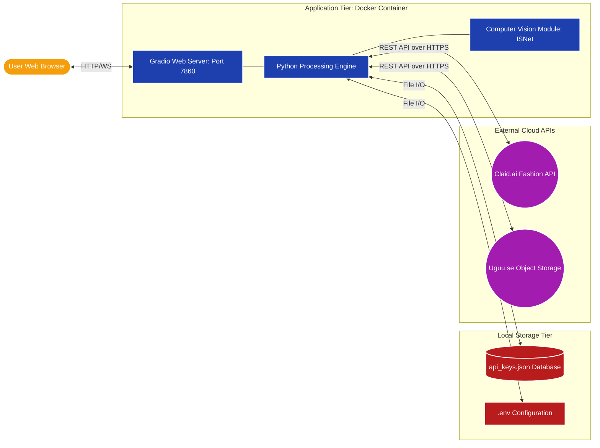

# v5 Master Pipeline Architecture

Below is the complete visual representation of how the `v5_Earring_Mockup_Final` system is wired together. 

Because GitHub automatically supports Mermaid diagrams, this code block will render as a beautiful, interactive flowchart (exactly like Freeform) when you look at it on your GitHub repository!

